# The great reset, reimagined.
\(the alternative to [this](https://www.weforum.org/great-reset/)\)
## Follow me
|              |                                                              |
| ------------ | ------------------------------------------------------------ |
| **Parler**   | https://parler.com/profile/Raz83/posts                       |
| **Minds**    | https://www.minds.com/Daezohn/                               |
| **BitChute** | https://www.bitchute.com/channel/daezohn3/                   |
| **Twitter**  | https://twitter.com/Lekker94                                 |
| **Steemit**  | https://steemit.com/ (Account coming soon)                   |
| **Hive**     | https://www.hive.org/socialnetwork/ (Account coming soon)    |
| **Hyprr**    | https://hyprr.com/profile/daezohn https://hyprr.com/channels/daezohnx |
| **LBRY**     | https://open.lbry.com/@daezohn:4                             |
| **Jami**     | daezohn                                                      |
| **Gab**      | https://gab.com/Daezohn                                      |
| **Discord**  | https://discord.gg/pCJ3F5Y2                                  |
## ## TL;DR (Videos)
[HOW TO SOLVE ALL THE PROBLEMS IN THE WORLD, 2020 AND ONWARDS.](https://www.bitchute.com/playlist/eg9TjoLp0pwu/)
## Reasons for leaving Facebook
When I first started using FB 10 years ago, it gave me something new that texting, email or MSN Messenger didn’t provide: A way to lookup and connect with old school friends from SA and news feeds where I can see what my friends are up to in one place. 

However, through shadow banning, I am not seeing any of my friends’ activity in my newsfeed anyone, my newsfeed is just full of posts from FB pages. I also have already reconnected with old friends, so FB adds no value in that regard either. 

In fact, it is stupid that we have to use FB and WhatsApp as an intermediary: we need emails and phone numbers to set it up anyway, so we may as well contact each other directly without enriching a malevolent third party intermediary. Moreover, decentralised social media platforms like Steemit and Minds that don’t have centralised companies making all the profits from advertisements actually share the profits out between the users of the platform. Yes, you get money for posting and getting ‘likes’ when you generate views to these platforms. So, basically, we are on FB, giving away our time and private information for free, making others rich when it is us that should be rewarded for the value we add, only to be manipulated. We have been had as complete and utter fools. 

Silicon valley companies (not the internet), have become detrimental to society and I feel it is everyone’s personal responsibly to break this trend for the good of society. It has been known for a long time that FB is responsible for various unethical practices, but we have continued to be complacent use the platform. FB is one of the root causes of a lot of the problems that the world faces today, and it isn’t going to get any better if we continue to use it.

It is hard to break trends and to get people to all move across to the same alternative platform as there are just so many alternatives to get any form of cohesion. The trick is to keep things simple. Everyone has email and email contact lists. You can even do group chats and newsletters with email.

## Last updated
2020-10-31

## Prelim

This book will take a scientific and philosophical viewpoint of the world and the current times, not a political viewpoint. So, lets first address and deal with the issues of political bias, so that we can put that behind us so that we can think about how to progress towards more constructive and positive findings in the rest of the book.

Before we continue lets have a quick think about public discourse. We need to have a think about the standards of debating that we are experiencing in the age of social media. One thing that I have noticed is that debates have become mainly orientated towards discrediting participants, rather than providing intelligent counter arguments about the topic being discussed. To me, this indicates a new era of fascism created by social media "echo chambers" and this is made possible by of algorithms that learn your preferences like any other AI recommendation system.

### Who is right?

Ego kills debate, but surely the most intelligent person is right, right..? And if the most intelligent people normally have certain viewpoints, then surely those are the correct viewpoints to have, right..? Lets looks at this from a different perspective.

Lets assume for a minute that it is the case that certain political viewpoints are correlated with intelligence \(and that is a big assumption, because I have seen complete idiots on all sides of the political spectrum\). Does being more intelligent while you hold your viewpoint, opinion or preference make you right?

Of course, this depends on your definition of what is "right". Are we talking about factual correctness or moral correctness \(not to be confused with "political correctness"\)? As I will be explaining later on, intelligence is ultimately a survival weapon and intelligence doesn't require morality: being more intelligent doesn't necessarily make you good or right, but it makes you more cable of serving your own interest. Judgement shouldn't be about how intelligent or charismatic a person appears, but about how good their intentions are believed to be.

Having said this, it can also be true that a person, a group of people or a political ideology may have the most sincere and goodhearted intentions, but the ideas that they have could be so unintelligent that following their plans would lead to complete and utter disaster.\(\*Cough\*, \*cough\*... \[insert political party you hate here\].\)

## 1. Overview

The genie is out of the bottle. 2020 will be remembered as the year that modern human civilisation reached a crossroad: Where we turn from here, will determine whether we head down the path of utopia or dystopia. The only thing that is certain, is that the word will never be "normal" again.

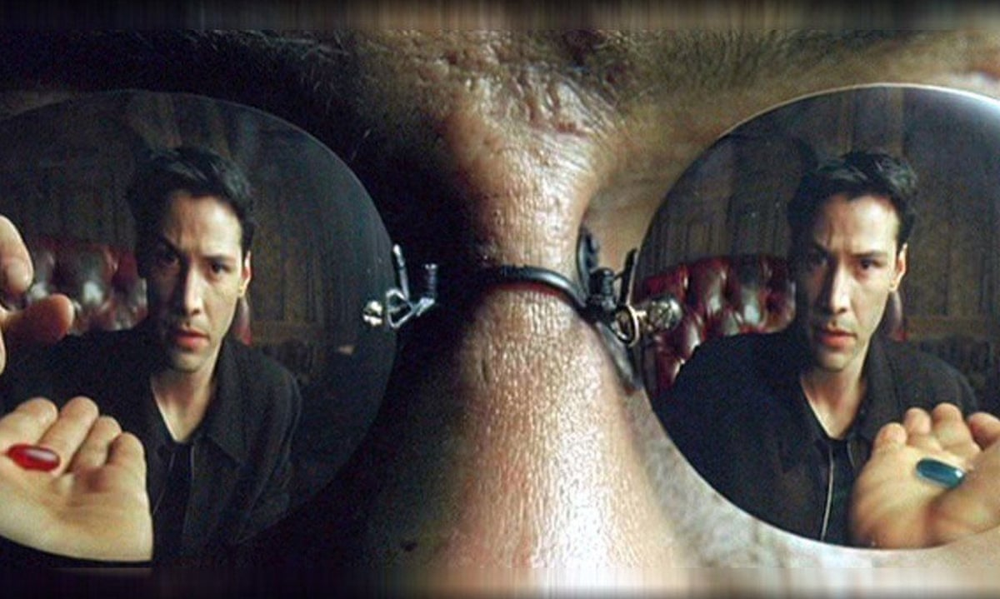

The status quo was never sustainable. The financial, political, cultural and educational systems were all in a desperate need of a shakeup. Having said that, this doesn't mean we should choose the first options that we are presented with when we get to choose what "the new normal" entails.

Lets explore an overview of:

* The outlook,
* the obstacles and
* the solutions.

### 1.1 The outlook: Solutions, optimism and the natural order

We will be exploring three different aspects of in our outlook:

* Solutions,
* optimism and
* the natural order.

#### 1.1.1 Solutions

The primary purpose for writing this, is to offer **solutions**. The news, the internet and casual conversations have all been dominated by negativity. I will be taking the opposite approach here. I am not selling you anything, so I don't need to exploit the adaptive evolutionary function of negativity bias to compete in the attention economy as the media do. The evolutionary function of our negativity bias isn't compatible with the current workings of digital media and social media in the information age. We are at an awkward stage of metamorphose in our technological civilisation, but we need to ensure that the finished product is a butterfly and not a moth, as I will be describing.

#### 1.1.2 Optimism

Everything is subject to entropy. Unless we learn how to do time travel, or to hop between parallel universes, the human species is subject to the same fate as the dying stars that have been radiating the life into our universe - even if we outlast our own planet's mass extinction events during the normal progression of cyclical geological periods by becoming a multiplanetary species...

The laws of thermodynamics can be quite dismal, but just remember this: Everything is cyclic. It depends on whether you look at it from the micro or macro perspective. In the same way that an internal combustion engine has a thermodynamic cycle, the [Big Bang itself](https://github.com/daezohnx/reset-reimagined/tree/79ab0d889fcd4889053c93d0f69711c2bf9896b2/Reading%20List/Endless%20Universe.pdf) might also have been part of a thermodynamic cycle.

However, the biggest, most imminent threats to humanity are anthropogenic threats: nuclear, bioterrorism, cyber warfare, quantum computing and artificial intelligence \(human redundancy\), technocratic dystopia, etc.

Fortunately, there are **simple solutions to disarm** most of these anthropogenic threats to humanity - just like you can extinguish various types of fires **using the same strategy**, such as starving the fire from oxygen. Yes, the solution the world's problems is really quite simple if everyone is aware that these simple solutions exist. The hard part is making everyone aware that said solutions exist.

The anthropogenic threats are only a game of Russian roulette with the same inevitable outcome if we keep playing that game. Otherwise, we might even endure long enough to develop the science to deal with the challenges associated with the entropy problem mentioned above.

#### 1.1.3 The natural order

Millennia... Centuries... Decades... Years...

More has changed in the last few centuries than what changed in the last few millennia. More changed in the last few decades, than what changed in the last few centuries. More has changed in the last few years, than what changed in the last few decades.

The rate of change to human civilisation has increased exponentially, just like the size of the human population itself. Our own evolution and habitat haven't been able to keep up with this rate of change. The current turbulence that we are experiencing is a metaphorical sonic boom. Human evolutionary psychology hasn't caught up with the post-industrial, post-urbanization and information age changes to society and this is causing friction in society. Fortunately, we don't need to adapt to our current established technology, as our technology is now maturing, it has become ready to adapt to us. We can now pull the milk teeth and get rid of the growing pains. We can return to a more natural order of the human experience that is aided by technology, instead being disrupted by it.

### 1.2 The obstacles: Intermediation, artificialness and atomisation

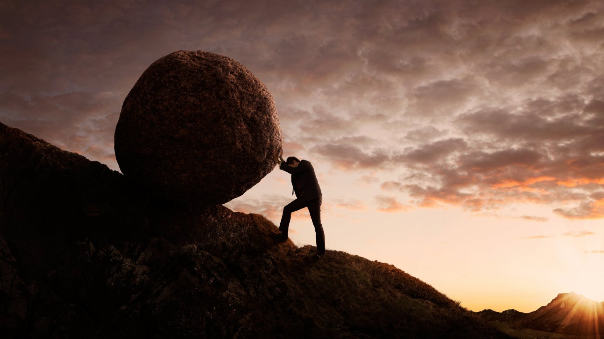

We will be exploring three types of obstacles:

* Intermediation,
* artificialness and
* atomisation.

However, first, lets look at one case study.

#### WTF Happened In 1971?

| 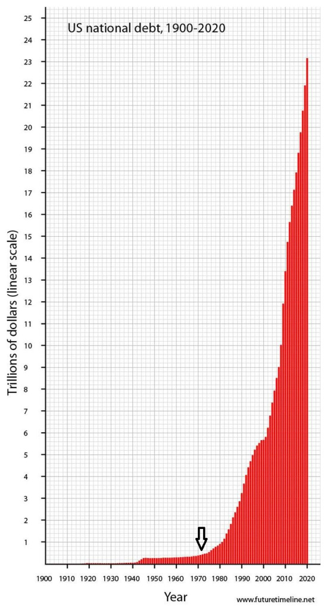 |  | 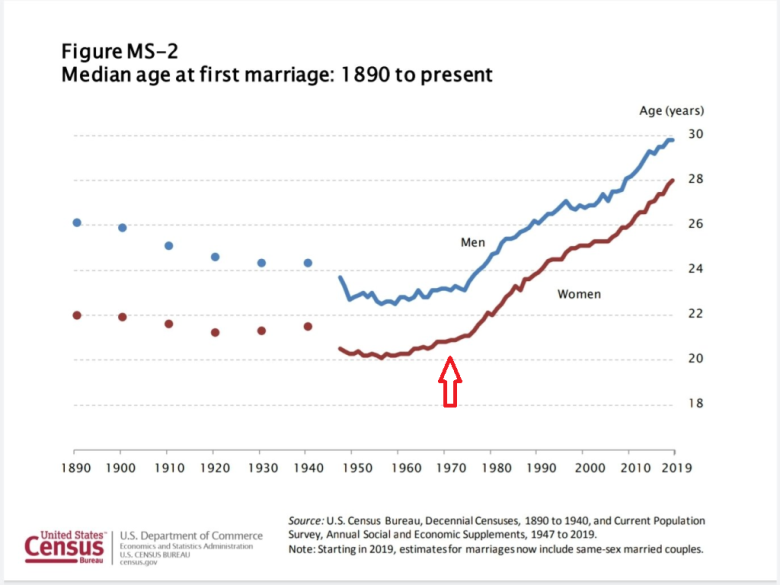 |
| :--- | :--- | :--- |
|  |  |  |

There is an interesting website, called "[WTF Happened In 1971?](https://wtfhappenedin1971.com/)" that shows a lot of interesting information about things that changed drastically in society in the past half century.

...So then, what happened?

I will be exploring three factors:

* Intermediation,
* artificialness and
* atomisation. 

#### 1.2.1 Intermediation

Intermediaries have been added to all aspects of our lives. Third parties store our money, third parties teach our children and - as I have seen with most of my friends that have now divorced their partners - third parties now also take up the role as intermediate breadwinner though child support allowance as the concept of the nuclear family erodes. Hell, third parties now also determine how most of us meet our partners in the first place \(eg Tinder\). When the effect of all these unnatural circumstances compound and result in depression, then, guess what.. Third parties are also the way to deal with depression with medication and impersonal organisations.

Lets have a brief overview of some the examples mentioned above.

**Third parties store our money:** Banks have been there for centuries. However, it is only in recent history that most countries moved away from independent banks and towards central banking. More important, in 1971 President Richard Nixon announced that the US would no longer convert dollars to gold. As we saw in the previous section ["WTF Happened In 1971?"](blog.md#WTF-Happened-In-1971?), this clearly had a paradigm shifting effect on the world. We will be looking at this in more detail later.

**Third parties teach our children:** Over the course of 200, 000 years of human history, it is only in relatively recent times that most of humanity was **NOT** employed in agriculture.

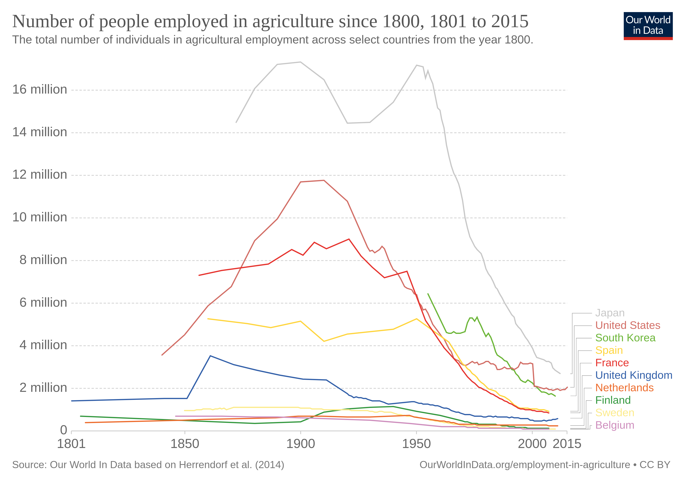

It is no co-incidence, that this shift in agricultural employment occurred soon after the industrial revolution and urbanisation. Children used to learn the relevant skills that they needed to work in the sectors where they will be employed throughout millennia of human history. With the rise of factory employment after the industrial revolution, also came the need to train obedient factory workers to carry out mundane, repetitive, thoughtless labour. This is why lobbyists ensured that schools instil discipline with school uniform, bells and allocated seating. This model of education, however, is no longer compatible with the requirements of the information age. During the Covid lockdowns of 2020, many parents may have realised this when their children took online classes. Another concern is the relevance of the subjects taught at school: isn't **financial** and **computer** literacy more important for life skills than **political**, **social justice** or **gender study** teachings?

**Third parties now also take up the role as intermediate breadwinner:** _\(Disclaimer: This will be one of the very few places that I discuss politics, the next time I mention politics will only be to demonstrate how it has become completely irrelevant.\)_ The welfare state, or socialism. The breakup of self determination of nations and cultures and the increase of single parenting. This is a vicious circle. It creates a population that become increasingly dependent on the state. The state grows bigger and have more influence over what is taught at schools, which leads increase support of the very same state. With all the BLM and Antifa riots in USA and UK in 2020, something has caught my attention. No, I am not talking about the statues that were being torn down or defaced. No, this isn't about history of slavery... All civilisations have had slavery and it is still ongoing everywhere in the world, it is only the West that **abolished** it. No, this is about something else... Something bit deeper. I have heard a phrase that has become popular in America: "white privilege". Firstly, it is actually quite racist to believe in this, because it implies superiority. However, in a surprising way, it is actually true that, to a certain extend, white people in America **are** privileged, despite affirmative action. This has to do with a deeper rooted problem that affect some communities more than others: fatherlessness. Fatherlessness in communities is another problem in society that causes a vicious circle of state dependency: The more a community faces fatherlessness, the more problems there will be in that community and therefore the more they need to sate to intervene, and in turn, the more the state can rely on the vote of said community. However, the state has no incentive to ever solve those issues as doing so would make them redundant. Basically, in the USA, the Democrats **STILL** believe they own black people, just like they did before the American civil war. In the words of Joe Biden, if you are not voting for him "[then you ain’t black](https://www.latimes.com/opinion/story/2020-05-22/biden-says-if-youre-black-and-dont-vote-for-him-youre-not-black-hes-right)". Fatherlessness is also correlated with gun crime and mass shootings \(and so is medication\), but more on that later.

I have given a few examples of how intermediation has been introduced into all aspects of our lives and when this is all combined, it is quite powerful. On the one end of the scale it is facilitated by small companies and organisations, but on the other end of the scale large corporations and governments play a bigger role. But what if I told you, all this is still relatively trivial by comparison to something much more important, yet something rarely receiving any attention at all? What makes the world go round? What is more important and more powerful than the governments, but rarely scrutinised \(while we are fighting amongst each other over nonsense\)? I will be discussing money and central banking later. But for now, have a look back over this graph that I have introduced earlier. It shows how more intermediation has also taken away most financial freedom from most people.

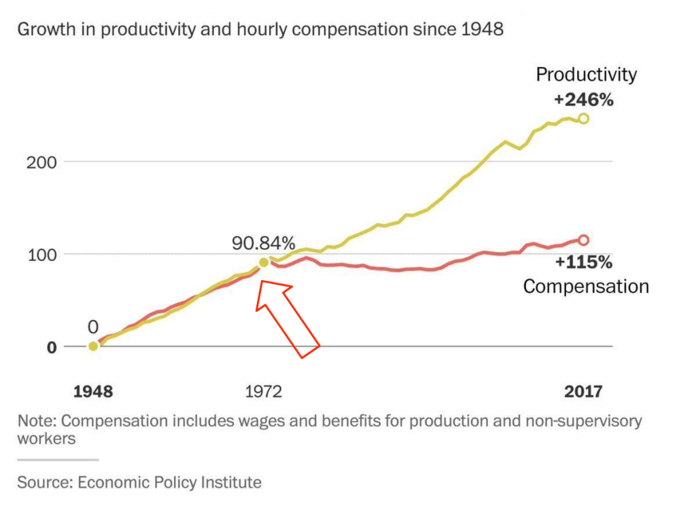

As we will be exploring later that centralisation and intermediation do have allot of benefits in certain scenarios, but too much centralisation and intermediation isn't a one-size-fits-all solution for all problems and it doesn't always benefit all the parties concerned equally. As we will see, in many cases **disintermediation** and **decentralisation** has a lot of benefits. Too much intermediation in all aspects of our lives can lead to a lifestyles that are too artificial and atomised.

**1.2.1.1 Human Well-Being: Health, wealth and social needs**

Human beings are complex, with a lot of complex needs. However, the most essential human needs can generally be categorised into three areas:

* Health,
* wealth and
* social needs.

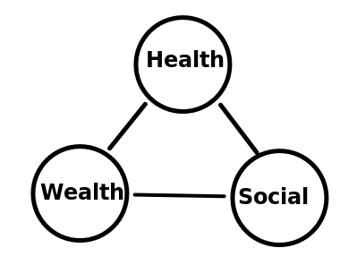

These three areas of our well-being are all affected by the processes of intermediation, artificialness and atomisation, with **intermediation being the most fundamental causal factor of a lot of issues**.

**Health, wealth and social needs** are topics that we will be revisiting several times as we explore exactly how intermediation has caused problems in all three of these areas and most of these problems can be solved with **disintermediation** or **decentralisation**.

#### 1.2.2 Artificialness

_\[...\]_

#### 1.2.3 Atomisation

Aside from intermediation, there are other way in which our live are getting more and more atomised. Mostly through automation and digital transformation towards online services and commerce. Although, it can be argued that this too, is an elaborate form of intermediation since these automation an digital transformation services are provided by a very log chain of intermediary services.

I still remember the friendly and very chatty shop keepers from my local family shops in my home town. Over a decade later, I only really use self checkout machines in supermarkets. More recently, in 2020, online shopping has become a permanent alternative.

**1.2.3.1 Cultural, physical and psychological**

_\[Divide and conquer\]_

### 1.3 The solutions: Disintermediation and decentralisation

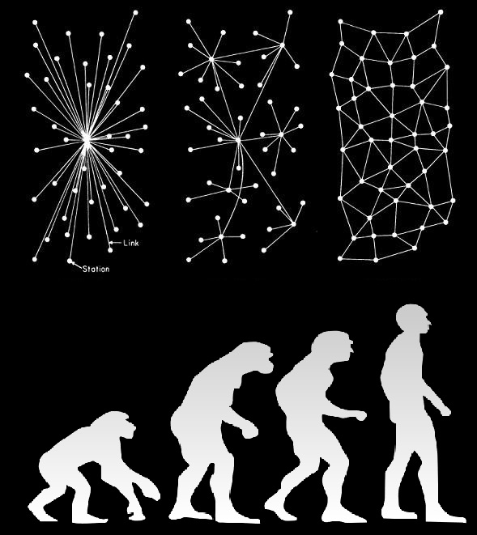

We no longer live in the paleolithic era. It is therefore harder to benefit from a healthy paleolithic diet, but for the most part this is outweighed by all the other benefits that modern provides us. Over time, and on average, humanity progresses for the better. Does this mean that every year in human history is better than the previous?

Of course not. It is not a steady slope upwards: there are pits and valleys on the route. There have been dark decades and centuries and so will there be in the future. _“Hard times create strong men. Strong men create good times. Good times create weak men. And, weak men create hard times.” ― G. Michael Hopf, Those Who Remain_

Maybe, what we are seeing in 2020, everything from the complete complacency with complete authoritarianism to the riots in the UK for no reason at all, can be explained by a deep rooted psychological issue with modern individuals: A lack of meaningful lives and a desperation to find purpose in a manufactured crisis. To quote Tyler Durden in Fight Club: _"Man, I see in fight club the strongest and smartest men who've ever lived. I see all this potential, and I see squandering. God damn it, an entire generation pumping gas, waiting tables; slaves with white collars. Advertising has us chasing cars and clothes, working jobs we hate so we can buy shit we don't need. We're the middle children of history, man. No purpose or place. We have no Great War. No Great Depression. Our Great War's a spiritual war... our Great Depression is our lives. We've all been raised on television to believe that one day we'd all be millionaires, and movie gods, and rock stars. But we won't. And we're slowly learning that fact. And we're very, very pissed off."_

When it comes to human advancement, there can be something such as "too much of a good thing". Or rather, what is described as "a good thing" can be relative.

Lets take a look at the abstract concepts of centralisation and decentralisation. In the previous section I have described what problems intermediation can cause in various aspects of our lives when it isn't applied correctly or over applied.

In my opinion, there will always be a " yin-yang" relationship between centralisation and decentralisation in the practical world of human activity. In the military world, for example, you absolutely need central command and generals to make strategic decisions. On the other hand, you also need NCOs with enough autonomy to make decisions on the ground. You don't want every NCO to radio call the general to micro-manage every single firefight, the general would be completely overwhelmed. Furthermore, in the military environment, centralisation and hierarchy can be established because sacrifice of self interest is required - Often when these same demands for self sacrifice are made outside of the military environment, it is only done by a party that stand to benefit from it.

Lets take the military analogy a step further. The Internet was created by DARPA because the older circuit-switched network topology relied on **central exchanges that were a strategical weakness**. In response, they developed a **decentralised, packed switched system** based on Internet Protocol \(IP\). The internet was born with decentralisation in its DNA. However, the current form of the internet has become so centralised again that when someone ask you to do an internet search for something, the commit genericide and say "Google it". As a computer scientist, this absolutely fucking boils my piss! These companies that have worked so hard to centralise the internet again have committed a crime against humanity and the magic of technological innovation as bad and as evil as a veterinarian that decides to cut off the wings from an eagle and replace it with frog legs. Don't take my word for this, I agree with [the speech Sir Tim Berners-Lee give](https://www.ted.com/talks/tim_berners_lee_the_next_web/transcript) about the injustice of our data being siloed by private companies can government instead of using linked data. But I have some good news, the tide is turning on this with new developments, as I will be discussing later - I guess for the internet to have become accessible and adapted by the general public, it had to go through a phase of being semi-retarded, doped and wired to the moon.

We just explored centralisation and decentralisation in the context of military strategy. Similar examples can used in a technical context with regards to computer hardware. Computers typically have **central processing units** \(CPUs\) that are good at general purpose arithmetic and high level co-ordination. However, they are generally bad at mass, repetitive processing tasks such as video graphics, that is why there are separate **graphical processing units** \(GPUs\). There are some interesting differences and similarities between how computers process information and how human brains do, which I will explore later.

A complete analysis of the different effects of centralisation versus decentralisation will probably require a detailed studying of branches of mathematics such as topology, chaos theory, entropy and game theory as well as philosophy, to name a few. For example: [Distributed vs centralized game theory-based mode selection and power control for D2D communications](https://www.sciencedirect.com/science/article/pii/S1874490719303064)

\(On a different but related note, in December 2015 there was a patent released "[DECENTRALIZED AIR TRAFFIC MANAGEMENT SYSTEM FOR UNMANNED AERIAL VEHICLES](https://patentimages.storage.googleapis.com/30/d0/4d/1a031e6fe75e10/US9997080.pdf)". I came across this earlier this year and found it quite amusing because at the same time that this patent was release I also invented software that would allow drones to collaborate without any central co-ordination for my university research project. I'll maybe discuss this further in the chapter about technology later on. \)

I mentioned earlier "Fortunately, there are **simple solutions to disarm** most of these anthropogenic threats to humanity - just like you can extinguish various types of fires **using the same strategy**, such as starving the fire from oxygen" I then also explained about the specific areas of human well-being that can be affected detrimentally by intermediation or centralisation that isn't applied correctly, or is being over applied, namely: health, wealth and social needs. In the next two chapters, we first go into a deeper exploration of the problems relating specifically to these areas and then we will go into the specific solution to these problems in the following chapter.

## 2. How the obstacles that affect human well-being issues: Health, wealth and social needs

### 2.1 Health

New year, new me, new gym membership... or supplements... It is obvious that modern life offers us a lot of **artificial** solutions provided by **intermediaries** to try an compensate for the lack of natural healthy living. Obviously, it can also be argued that human life expectancy has grown over time and therefore it outweighs these issues.

At the time of writing \(September 2020\), [1,392 people \(or 0.002% of the population\) died](https://www.england.nhs.uk/statistics/wp-content/uploads/sites/2/2020/09/COVID-19-total-announced-deaths-3-September-2020-weekly-file.xlsx) of Covid-19 in the UK without pre-existing conditions, mostly over 60 year olds. In my age group \(20 - 39\), 33 people died. When we include deaths where pre-existing conditions were present, the number is 29,585. I have heard the argument that deaths where there were preexisting conditions are still deaths, but this is a slippery slope that reminds me of [Public Health England that over counted deaths](https://www.spectator.co.uk/article/why-no-one-can-ever-recover-from-covid-19-in-england) to the extend that if you were hit by a bus and had Covid, you still died from Covid. Given that it isn't as big as the [2018 virus outbreak](https://www.dailymail.co.uk/health/article-5440785/Killer-flu-outbreak-blame-42-spike-deaths.html), or the [170, 000 deaths a year from cardiovascular disease](https://www.bhf.org.uk/-/media/files/research/heart-statistics/bhf-cvd-statistics-uk-factsheet.pdf?), it is reasonable to ask if the lockdown action was disproportionate. Especially when you consider that we have never taken such drastic measures before in our lifetimes and that [there wasn't even a centrally imposed lockdown during the Spanish flu](https://www.bbc.co.uk/news/in-pictures-52564371). Not to mention the estimated 200 000 that will die because of the [collateral damage of lockdown](https://www.dailymail.co.uk/news/article-8539541/200-000-people-die-delays-healthcare-report-warns.html). Moreover, the decision was based on [unreliable models](https://www.telegraph.co.uk/technology/2020/05/16/coding-led-lockdown-totally-unreliable-buggy-mess-say-experts/).

Then there is the case of Sweden, that did much better than the UK with no lockdown. Don't get me wrong, I am a software engineer and I have preferred to be working from home, but I don't think the government was right to dictate this sort of thing for those that can't work form home. One common counter argument that I often hear about Sweden is that they have a lower population density than the UK. This is only half true. It is true that on average Sweden has a lower population density, but most of Sweden is empty space and the people are still concentrated in the cities. It doesn't have the geography of middle America, for example. Another counter argument is that Sweden did worse than their neighbouring countries. I am not claiming Sweden is perfect, they could have done a lot more to shield their elderly and vulnerable, where this would have had the most effect, but they certainly did a lot better than the UK.

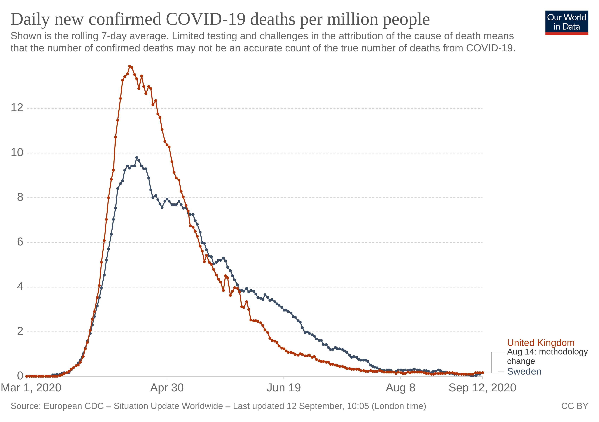

On the other hand, the outbreak only really started in the UK when winter ended and we are now about to enter a full winter, so the figures might still change drastically. Regardless, new and more deadly viruses will always be inevitable, even if this pandemic turned out to be an over reaction. Also, the events of this year will have a permanent impact on the mindset that people have about these issues. So we need a way to deal with both the new mindsets, but also new threats. Luckily \(or unluckily?\), we have some very powerful new technology at our disposal in 2020, including Blockchain digital ID. But, it is very important that we use it correctly, otherwise it can cause damage to society in ways that were never possible before. Hint: We **must** use the **ZOOPOS** approach \(explained later\).

### 2.2 Wealth

Lets get to the bottom line: Ever since the "I promise to pay the bearer, on demand, the sum of" promise on banknotes has become false, it has been the biggest pyramid scheme in history, designed to funnel wealth to the top.

Instead of being backed up by something of scarcity like gold, currency is now just printed out of thin air along with the creation of debt. With no limits on the supply of currency, it not only looses value over time, but it allows things that are priced based on the availability of debt to go through run away prices. This affects mortgages and house prices the most, because they can be taken on debt. Leading to less and less people being able to afford it in the first place, but also more and more people to loose everything they have worked for their entire life when they can no longer keep up the payments \(especially in recessions\). It is a system that is systematically locking people out of owning assets and private property while redistributing more and more to the top 1%.

The entire momentary system has become a complete scam, unsustainable and we need a new system that works in our modern world. Luckily, we have a solution, that I will be discussing shortly.

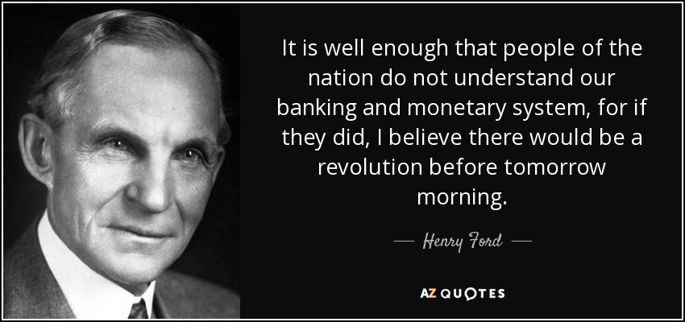

_\[We are tax livestock \[fear and enslavement\]. I have been describing how, through intermediation, artificialness and atomisation, we have decoupled from most of our autonomy, sovereignty, self determination and individuality. \]_

### 2.3 Social

_\[...\]_

#### 2.3.1 Population density

The current distribution between urban and rural settlement is now very likely like to change drastically. This is obviously influence by geography, island countries like the UK will not change as quickly and drastically like north America, for example. However, in general, I see one of the following to scenarios playing out, with hardly any middle ground:

* Near complete urbanisation and high density living.
* Near complete deurbanisation and remote working and schooling.

**2.3.1.1 The complete urbanisation scenario**

One possibility is an acceleration to words complete urbanisation and high density living. Within a decade or two, we could live in a world without possessions. We all know that possession of property has already become out of reach for most families since the events of 1971 that I covered earlier and this trend is likely to accelerate in the current climate.

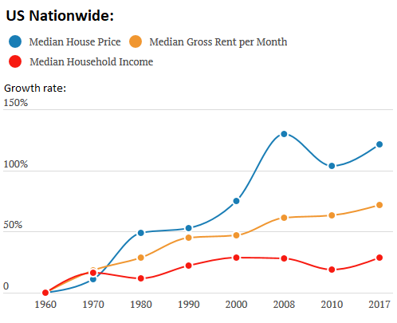

Elon Musk has been making the concept popular with ideas such as shareable Tesla cars and selling all his personal possessions. Back in the UK, Borris Johnson has recently passed new laws allowing for listed buildings in city centres to be knocked down and converted into high density living. This could coincide with the death of a lot of high street shops because of Covid. Unfortunately, one possibility is that a lot more people will become reliant on the sate so they would be less likely to oppose any new measures such as digital identity and immunity certificates and if we are really unlucky, a social credit score system [like the one they have in China](https://www.theguardian.com/world/2019/mar/01/china-bans-23m-discredited-citizens-from-buying-travel-tickets-social-credit-system). I discusses earlier that the state often becomes an "intermediate breadwinner" when I discussed the problems with intermediation and centralisation.

Complete urbanisation could eventually lead to ultra high destiny living like these sleeping pods and communal areas with limited access to private property.

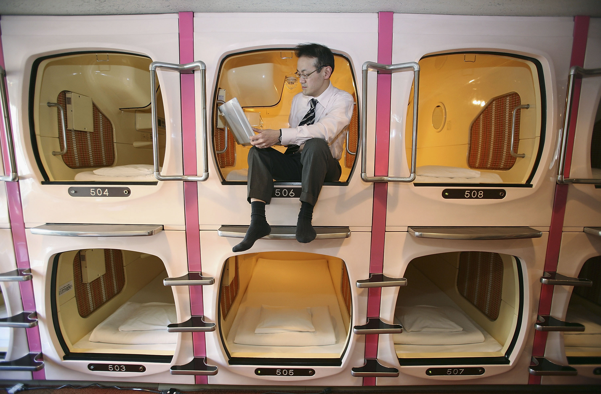

In the future, these high density living spaces can be managed by digital identities such as [TENTO WALLET](https://tentohealth.com/) \(previously called Covi-Pass\) though new government housing benefit schemes. Almost like the AirBnB bookings where you are given the door entry codes in advance, but much more automated and centrally controlled. The UK government are also currently working on digital IDs: [Digital ‘ID cards’ lead the Dominic Cummings data revolution](https://www.thetimes.co.uk/article/digital-id-cards-lead-the-dominic-cummings-data-revolution-v750fn3kt).

I have to point out one think here. I don't object to truly self-sovereign and privacy focused digital identities. It is a topic that I have been researching long before Covid. If the right technology is used voluntarily for the right reasons and it is used correctly, then it will benefit individuals more than it will benefit governments and organisations. The problem is that at the moment it requires expert knowledge to identify appropriate use of blockchain technology it implement self sovereign digital identity. Large organisations may claim their software is blockchain based and "self-sovereign" when in reality the user doesn't have full control. I will therefore explain the **ZOOPOS** principles later when I discuss the technology to ensure that people are not mislead.

[Ireland and The Loss of Private Property Rights](https://youtu.be/icgXLM2qKqU)

[The Sounds That Are Unbearable \(Misophonia explained\)](https://youtu.be/1LFBQ3EP3Pg)

**2.3.1.2 The complete deurbanisation scenario**

Earlier in the book I discussed the concept of the natural order of thing. Throughout most of human history we have lived and worked on agricultural lands. Urban living is simply unnatural and it was part of an industrial age era that is well and truly archaic in the information age. Yes, we still have a lot of industry and industrial work, but a lot of city office space and work commutes are done for work that can easily be done from home or even at a local remote workspace, as we have seen in 2020. I am a great believer in the concept that if something doesn't feel right or natural, it probably isn't. I have never, while I stayed in London and commuted to work standing under the sweaty armpits of others in the Tube, thought to myself: "This is right, this is progress, this is the natural order and the best way for humanity to progress."

In a post-industrial information age, there is less need for our current unnatural urbanised structures in society. The virus restrictions, riots and the possibility of remote working combine has lead to [masses of people leaving New York city](https://www.dailymail.co.uk/news/article-8345919/Young-people-joining-rich-leaving-NYC-cheaper-dense-cities-coronavirus.html). In this scenario, there will also be less of a need for digital immunity certificates.

The [insanity of the Capitol Hill Autonomous Zone \(CHAZ](https://youtu.be/SJKt9THw93A)\) may just have been an inoculation against socialism that the West has needed.

[Children raised in greener areas have higher IQ, study finds](https://www.theguardian.com/environment/2020/aug/24/children-raised-greener-areas-higher-iq-study)

## 3. Solutions for the obstacles that affect human well-being issues of health, wealth and social needs

### 3.1 Health

I mentioned earlier about [the speech Sir Tim Berners-Lee give](https://www.ted.com/talks/tim_berners_lee_the_next_web/transcript) about the injustice of our data being siloed by private companies and government instead of using linked data and that there are new developments to solve these problems. With the current situation in 2020, there is no better example of how this can be an injustice to humanity then when it comes to how the selfish, profit driven behaviour of institutions could have consequences to how efficiently we deal with issues relating to human health.

#### 3.1 Vaccine development in a digital era as public, neutral and transparent utilities

For the reasons stated above, It is therefore important that future vaccine programs have the following properties:

1. Fully transparent research published in open access journals \(verified through digital fingerprints\), without any patented technology would give any institution the possibility to gain from a crisis.
2. Fully transparent and crowd sourced funding. \(Using the blockchain, with projects like [Fairchain](https://fairchain.org/) and [Moyee Coffee](https://moyeecoffee.ie/), is is possible to track funds so accurately that tipping for Coffee in a Cafe can be track all the way back to the Coffee bean farmer himself. This scale of transparency and lack of corruption and unethical profiteers will massively enhance encouragement to donate to causes.\)
3. Fully transparent manufacturing and supply chain. \(Projects like [OriginTrail](https://origintrail.io/) on the blockchain can help with this, OriginTrail will connect global supply chains and will likely be a Google sized giant in this area. The Google of the future distributed web may be something like [Blockscan](https://blockscan.com/).\)

It wouldn't be ethical to expect anyone to take any vaccine \(the ethicality of making it "mandatory" is something I will discuss later\) if it doesn't meet all three of the above criteria. Vaccines should be completely neutral in how they are researched, developed and funded. It should be a collaboration, not a competition motivated by standing to gain personally or as an institution. The fact that [Oxford University was hacked by Russia](https://www.theguardian.com/world/2020/jul/17/russian-hackers-steal-coronavirus-vaccine-uk-minister-cyber-attack), is concerning, because they shouldn't be competing, they should be collaborating. It should be solely about the interest of common public health, they shouldn't stand to gain from the situation in any way that could create conflict of interest as this will eventually lead so situations where the motivation is no longer based on the interests of public safety. I have heard the argument that "safety standards" and regulation would prevent any possible harm, but these institutions have no liability and [things keep slipping through](https://www.theguardian.com/science/2017/feb/09/ministers-lose-fight-to-stop-payouts-in-swine-flu-jab-narcolepsy-cases) and lets face it, whenever money is involved, [regulation doesn't really stand in the way](https://www.bbc.co.uk/news/business-34324772).

Therefore, I suggest that vaccine development programmes follow steps \(1\) - \(3\) that I outlined above to remove conflicts of interest. I am going to back this up further with a software analogy. Think about Windows and Apple OSX, proprietary systems. They are not as good as Linux, the open source system. In fact, Linux is the system that most of the internet servers run on, it is that secure and reliable. The reason? It is because it is open source and any software engineer in the world can examine it for any flaws. This same principle is definitely as must have when it comes to something high risk as vaccine research. Any research Oxford University do, need to be in the public domain so that any professor from any other university in the world can also examine it. The same principle also applies to cryptography, you might think this is counter intuitive, but as the saying goes "anybody can create a lock secure enough so that he himself cannot pick it."

On a deeper level, it would just be wrong if a company had a patent on a vaccine and it became "mandatory". This would mean that your body as basically an extension of their patent rights, making you the property of a private company to a certain extend. Whether you are religious or not, on a spiritual level this is just so wrong. Again this would be a problem with a **centralised** organisation \(by the way, there things called [decentralised autonomous organisations](https://blockchainhub.net/dao-decentralized-autonomous-organization/) that already exist\), the topics centralisation and **intermediation** keep showing up when it comes ethical issues.

I also mentioned earlier that at the time of writing \(September 2020\), [1,392 people \(or 0.002% of population\) died](https://www.england.nhs.uk/statistics/wp-content/uploads/sites/2/2020/09/COVID-19-total-announced-deaths-3-September-2020-weekly-file.xlsx) of Covid-19 in the UK without pre-existing conditions, mostly over 60 year olds. Does this mean I think we need to stop finding innovative ways to fund, research and distribute vaccines? No, quite the opposite. It is all about the bigger picture.

Even though, **at the moment**, Covid seems like a complete over reaction that doesn't warrant the radical measures being taken to vaccinate everyone, an inevitable more deadly virus in the future will require proportionate measures to be taken. Remember, some measure that we should consider taking, may seem quite radical when we compare it to actions taken historically in response to pandemics. For example, we never considered the use of digital technology to control and monitor human movements before \(although there are [claims that IBM helped the Nazis](https://www.wired.com/2001/02/did-ibm-help-nazis-in-wwii/)\). However, we have also never lived in a word so densely populated before where people could travel so far and so easily.

Regardless, the measures should be taken in a proportionate manner that protects individual rights \(I will address the ethicality of this topic in a later chapter\). Therefore, we need innovative solutions. The key is creatively **incentivise** the right behaviour in a way that doesn't sacrifice freedom or privacy using highly flexible **decentralised** technology, instead of trying to **control** behaviour though **centralised** laws. Often, there are very simple techniques that can lead to very effective emergent behaviour on the larger scale. Take for example, the way that ants are able to coordinate food gathering without any central control. It is purely an emergent behaviour that arises from the use of pheromones. **Emergence**, is a very important concept of real world and natural pragmatic intelligence \(as opposed to abstract and strategical intelligence\). I will elaborate more on this in the chapter about intelligence.

#### 3.2 How would we incentivise people infected with a virus to isolate themselves?

Digital creativity can be amazing and powerful. Do you remember how crowds of people were lured to geographic location to catch augmented reality Pokemons? Or how all the Antifa soy boys organised riots on Facebook and the embarrassment of a police service kneel to them \(ironically, while the same police arrest pregnant Australian women over Facebook posts\)? The revolutions that Facebook have assisted, [like in Libya](https://www.theguardian.com/world/2011/feb/25/twitter-facebook-uprisings-arab-libya)?

Perhaps a more formal example of new technology to directly influence behaviour in a persistent manner is the car insurance black boxes. Now imagine a decentralised app, developed as open source software like Linux or Bitcoin, that no organisation or government control. But just like Bitcoin mining \(or more appropriately [Geo-mining](https://medium.com/@JamesCridland/whats-the-geo-mining-app-coin-all-about-e2a77e52333f)\), you would be financially be incentivised to stay at home or at least to not be in the "congestion zone". There are clever cryptography tricks like hashing and Zero-knowledge proofs \(ZKP\) that can be used to load a verified positive test result onto the app to prove you are actually self isolating and not just a slacker, while at the same time the information never actually leaves your phone that make you personally identifiable. Therefore, fully protecting your privacy at the same time. This will eliminate the need for governments to try and control this centrally and therefore have an excuse to enforce authoritarianism or a technocratic dystopia. It is technology like the internet, or Bitcoin, that nobody centrally owns or controls, yet we all hugely benefit from it. How will it be funded? How much has the government wasted on furlough for healthy people that they locked down? How much of **your** tax money have they wasted? The answer is to strip government down to the most basic and critical services only and then use [decentralised autonomous organisations](https://blockchainhub.net/dao-decentralized-autonomous-organization/) to manage the rest. This will be infinitely more efficient and economical than anything the government do. This may all sound very complicated, but I am speaking as a software engineer, it really isn't. I could easily code this given a bit of time. Just like you don't need to understand how to program the Facebook app to download and use it, you also don't need to understand all the technical details of my suggestion here to be able to use it.

During a [TED talk](https://www.ted.com/talks/bill_gates_how_we_must_respond_to_the_coronavirus_pandemic/transcript?language=en#t-2041000) in March 2020, Bill Gates made the following suggestion: "Eventually, what we'll have to have is certificates of who is a recovered person, who is a vaccinated person". As much as I hate to say this, in a way, Bill Gates was right. However, emphasis on the word "**eventually**". It is inevitable that we face more potent viruses than the current one and that we also become more densely populated. Again, this isn't an excuse rush through a digital identity that will benefit any central institutions. As I mentioned earlier, I don't object to truly self-sovereign and privacy focused digital identities. If the right technology is used voluntarily for the right reasons and it is used correctly, then it will benefit individuals more than it will benefit governments and organisations. Large organisations may claim their software is blockchain based and "self-sovereign" when in reality the user doesn't have full control. I will therefore explain the **ZOOPOS** principles later when I discuss the technology to ensure that people are not mislead. It is a very powerful tool that can be used in society and the implications are much wider than just health related.

### 3.2 Wealth

What is money? Is it paper bank notes? Is it gold coins? Is it scarcity \(supply and demand\), or is is it about intrinsic value? Will any of this be of value if you were on a deserted island with it? Or is it the [Tinkerbell effect](https://en.wikipedia.org/wiki/Tinkerbell_effect)?

Or perhaps, a combination of the above?

Well, if you know me, you probably realise that I might come at this from a completely different angle and throw something crazy like Albert Einstein's mass–energy equivalence into the equation.

Actually, yes, lets do that.

As know, energy cannot be created or destroyed, only transformer. I view value \(or money\) in much the same way, it is transformed and passed on, not really created. In fact, I think there is a close relationship between money and energy.

**When will the world run out of oil?**

Never. Never at all. I currently do software development in the energy sector, so I will put in my 50p about this topic. The reality is that there will always be plenty of reservoir rocks left \(ignoring reformation from geological cycles that will out endure humanity\), but depending on the price of oil on the day, it may not always be economically viable to extract that oil. In other words, there is a constant economical equilibrium between the cost of the energy to extract the oil and profit generated from the energy that the oil itself contains.

What does Gold, Oil and Bitcoin have in common? They all take [a lot of real energy to mine](https://medium.com/@philippsandner/the-green-bitcoin-theory-how-are-bitcoin-electricity-consumption-and-green-energy-related-b541b23424ab).

Compare this to fiat currency, that doesn't have any representative value, any intrinsic value or even any significant energy cost associated with producing. Fiat currency is just rubbish, a pyramid scheme scam, chaff. That is why eventually all fiat currencies hyper-inflate and go to zero.

In the current economic crisis, free currency combined with low productivity \(goods and services provided\) will lead to hyperinflation in the mid term. This will harm savings you hold in national fiat currency like any hyperinflation event. This, combined with the bank’s efforts to get rid of “dirty cash” that spread the virus by creating a digital currency, will allow them to charge negative interest rates in an effort to stimulate spending and the economy – further eroding any assets that you have.

In the short term, the value of national currency will get stronger again as people liquidate the assets they hold in other markets that have been falling. In other words, national currency will become a safe haven in the short to mid term. Gold and Bitcoin may even loose value in the short term.

However, this will not last long. People are reducing their spending, money is being printed and less economical activity is taking place. This supply and demand imbalance between money and products will lead to inflation and then hyperinflation.

Currency is something that is: Portable, durable, devisable and fungible. Money is everything that currency is, but also a store of value.

The Pound, Dollar, Rand etc. are not examples of money, they loose value over time. They are just currency. Gold and Bitcoin is money.

Blockchain, the underlying technology of Bitcoin, is going to unlock a potential of the internet, money and business that most people haven’t even imagined. If you compare the internet to the invention of the wheel, then blockchain would be moving from horse drawn carriages to the steam engine and the automobile that supported the industrial revolution and give people autonomy. However, that analogy falls short. I would say it is like each of as having our own flying taxi drones that are self-piloted with source code that is open for anyone to view like Linux. Plus you don’t need a licence, vehicle tax, traffic police or air traffic control because all the self-piloted flying taxis talk directly to each other using the same software – and this software is free and open source.

Governments are now rolling out plans for their own digital currencies, but currencies are already mostly digital and this isn’t the same as blockchain cryptocurrencies like Bitcoin. What they are actually proposing is just a cashless society. It will be a little bit more convenient to use in the short term, but it is also programmable money so they will be able to control and monitor everything about your financial life and by extension your entire life in ways that wasn’t possible before. Once cash isn’t legal tender any more, there would be no escaping of the intrusiveness of this system. They may even promote it is a “legitimate” or regulated form of blockchain cryptocurrency by using some mutilated form of the technology that is in Bitcoin, but be assured it will not be an open, permissionless, transparent, decentralized, censorship resistant, global public ledger like Bitcoin is.

Facebook have tried this last year with their Libra project, but the US congress shot it down because of how untrustworthy Facebook are. Now, central banks and governments are promoting the same thing under their own control. Oh, the irony… Bitcoin is a blockchain that doesn’t require trust in any intermediaries. The trust lies in the open and transparent source code that it uses to send money directly between people without any intermediaries. All you need to trust is the mathematics that the algorithms use. If you don’t understand mathematics or algorithms, don’t worry, because people that do, trust it.

Einstein’s research enabled us to split the atom and create cheap, reliable, efficient, sustainable and, yes hippies, greener than anything you have come up so far, energy. BUT, it also enabled governments to build weapons that could completely destroy the biosphere and this remains an inevitable game of Russian roulette. Ironically, this is only possible because we fund governments by using their fiat national currencies to pay taxes. Voting at the polling station isn’t as powerful as voting with your money. Imagine, instead of paying taxes, subscribing to a decentralized autonomous organisation \(DAO\) that provide services that are in line with our personal values. DAOs already exist, see links below.

I am not going to go into the political debates of public services vs private enterprise, left vs right wing, etc. Because that political facade has less to do with how society actually functions than what WWE “wrestling” has to do with fighting. In short, money is the thing that makes the world go around, but the monetary system is what people are least educated about after leaving school. Why is that? People that get excited and passionate about politics appear less intelligent to me than people that go crazy about WWE wresting. How society functions is purely determined by how our flawed monetary system works. Politics mattered before central banks were created, but it is no longer relevant. Just like the church and the state was separated, the church and the bank also needs to be separated. We have a system of crony capitalism, not a true free market society. So it is impossible to compare the performance of public and private sector services from our current perspectives. Also, fiat currency got decoupled from the gold that was supposed the back up its value. Currency is just printed out of thin air whenever government or mortgage debt is created. But the more money becomes available to borrow, the more prices inflate and the more money needs to be borrowed. A vicious cycle of ever inflating debt that is slowly making it harder for families to become property owners and therefore the banks become the true owners of more and more of our assets.

The digitization of money is inevitable, it can either become the Black Mirror style dystopian social credit score system that China now have, or we could become the most liberated and free society unlike anything ever experienced in human history.

Say no to government issued digital currency. Say yes to Bitcoin.

Related news and information:

[https://www.forbes.com/sites/billybambrough/2020/04/03/forget-the-digital-dollar-the-digital-euro-is-coming/](https://www.forbes.com/sites/billybambrough/2020/04/03/forget-the-digital-dollar-the-digital-euro-is-coming/)

[https://www.telegraph.co.uk/news/2018/03/24/chinas-social-credit-system-bans-millions-travelling/](https://www.telegraph.co.uk/news/2018/03/24/chinas-social-credit-system-bans-millions-travelling/)

[https://www.bbc.co.uk/news/business-51851523](https://www.bbc.co.uk/news/business-51851523)

[https://www.barclaycard.co.uk/business/news-and-insights/what-is-psd2](https://www.barclaycard.co.uk/business/news-and-insights/what-is-psd2)

[https://www.theverge.com/2019/10/23/20929313/mark-zuckerberg-hearing-congress-libra-calibra-facebook-maxine-waters](https://www.theverge.com/2019/10/23/20929313/mark-zuckerberg-hearing-congress-libra-calibra-facebook-maxine-waters)

[https://medium.com/@Borderless/decentralized-autonomous-organization-dao-the-future-of-governments-4417622db76c](https://medium.com/@Borderless/decentralized-autonomous-organization-dao-the-future-of-governments-4417622db76c)

Just for fun:

[https://www.reddit.com/r/conspiracy/comments/6n0tn9/yellen\_im\_strongly\_opposed\_to\_audit\_the\_fed/](https://www.reddit.com/r/conspiracy/comments/6n0tn9/yellen_im_strongly_opposed_to_audit_the_fed/)

[https://brrr.money/](https://brrr.money/)"

### 3.3 Social

Blockchain social networks are an amazingly good thing for society. Just think about how [negatively Facebook](https://youtu.be/D5-X915iKTc) affected society. I remember the days of ICQ, MSN Messenger and MySpace and compared to the Facebook era, I only have positive memories of this time. It was a time when it was organic and not manipulated by central organisations using algorithms. It was a time when people had the common sense not to use your real name on the internet when you speak to strangers \(as opposed to the current time when people call your account "fake", even though it exist on the same database as theirs, if you are not one of the idiots that use the same name and date of birth on your account that the bank uses when they do their security checks.\)

Fortunately, blockchain social networks not only allow us to undo the harm done by silicon valley **centralised** social media companies, it allows us to have it better than ever before. In fact, the users get all the profits as reward for the value that they bring to the platform when there isn't a central organisation that owns it! \("Likes" or "upvotes" effective tip you in cryptocurrency.\)

Censorship resistance, is the other benefit of blockchain social networks. However, this is a double edged sword if it isn't done correctly. Because obviously, if you store user generated content directly on the blockchain, it cannot be removed from there and some dark web content may end up on there. No problem, all you do is you use the blockchain as an index to points to content that is actually stored on a peer-to-peer file sharing network \(using distributed hash tables/IPFS\). This would actually make it easier for authorities to track down terrorists, peado's etc, while also making it harder to remove things that should legitimately be censorship resistant like whistle-bowing \(Wikileaks etc\). This includes ethical hackers. Basically the digital community will start to look after themselves and do it better than it can be done by entrusting a third party **intermediary**. **Steemit/Hive** is one blockchain social network that seems fantastic, But I am concerned about it seems to be storing user generated content directly on the blockchain \(although I haven't fully confirmed this\). **Hyppr** seems to be very promising blockchain social network that will be very popular and from what I have seen they also implement the separation between blockchain and user generated content correctly. However, they have too much control of their own network so they will censor content. We need a happy balance in the middle, so I may have to create my own social network platform. Other worthy mentions are: Minds, Bitchute, lbry.tv, dlive, etc.

#### 3.3.1 Digital Identity

Lets revisit again what I mentioned earlier about [the speech Sir Tim Berners-Lee give](https://www.ted.com/talks/tim_berners_lee_the_next_web/transcript) about the injustice of our data being siloed by private companies and government instead of using linked data and that there are new developments to solve these problems. He also mentioned social networks.

I described how blockchain social networks can give us back control of social media platforms and the content that we post online, but what about our identities? Social media platforms also have massive control over our digital identities, because we have single signons from Google and Facebook that follow us around on other websites \(even if you don't log in, using cookies\) and they store our identity information centrally and sell it on.

Most people don't know this, but it is possible to be be verified **and** anonymous on the internet at the same time. It is possible to only reveal the information that you absolutely have to. Whereas, if you log in with a Google or Facebook account, all your personal information is linked to that. It is about digital tokens. Think about it like this. Do you remember ever getting a rubber stamp to enter a nightclub and only having to show your stamp and not your driving licence when entering the club? Yes, like that. But there is a lot more too this and it is a lot more powerful, I will discuss it in the chapter about technology.

Digital Identity has the potential to bring a lot of positive change to society, but a positive contribution to society is dependent on the following conditions:

* It has to be used voluntarily.
* It has to implement the true self-sovereign digital identity principles correctly \(the **ZOOPOS** principles, as I will discuss in the technology chapter\).

[Digital ‘ID cards’ lead the Dominic Cummings data revolution](https://www.thetimes.co.uk/article/digital-id-cards-lead-the-dominic-cummings-data-revolution-v750fn3kt)

## 4. Intelligence

### 4.1 Micro-environment

\[..\]

## 5. Freedom

### 5.1 Crypto-anarchism

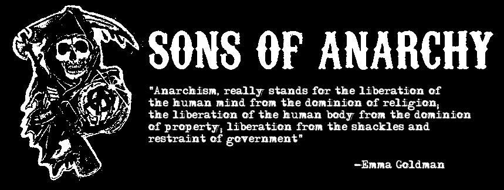

When people think about "Anarchy" they normally conflate that concept with the George Soros type soy boys Antifa. However, these are Marxist.

Other times, they conflate the the idea with countries that are plagued by ruthless mob rule and gang related crime. So, people also conflate "lawlessness" with "barbarism". Or they just conflate "anarchy" with "barbarism".

Consider this. The current systems of government and law that we have are archaic structures that evolved from a time before the internet. They are no longer fit for purpose in the information age \(just like the schooling system that was designed in the industrial age is also no longer fit for purpose\). Throughout this book, I have been describing how many different services can be made much more efficient and fair by decentralisation and cutting out the intermediaries. Government services are no exception \(this isn't an overnight change obviously, nor does it imply complete removal of government\). Most of the services that governments over can also be automated by smart contracts using [decentralised autonomous organisations](https://blockchainhub.net/dao-decentralized-autonomous-organization/) \(DApp\).

Think about it this way. If your mobile service provider is rubbish, is it more effective to do an opinion poll about your experience or to just switch to a different provider? People that vote in elections, but still pay taxes regardless of the outcome are really being taken for mugs. What if each country had a currency that represented each one of the political parties? So, to use a UK analogy, if the Tories pissed you off today, you don't pay with Tory Pounds but with Labour Pounds instead. Each is taxed and controlled separately by each party. You would be surprise how reluctant they would be to backtrack on any of their promises if they stand to loose financially and immediately. Obviously, this is just an analogy, it would sill be an archaic system if it doesn't take advantage from the automation of cryptocurrency smart contracts on DApps.

Lets use another analogy, have you ever seen these at Tesco?

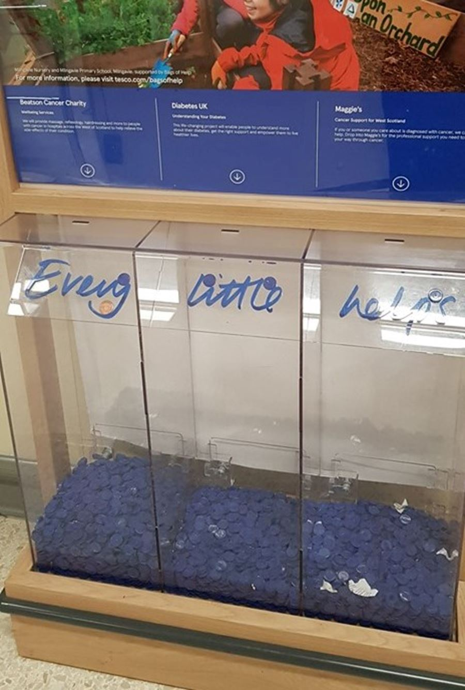

Everything I am describing here may sound very technical and complicated, but the underlying principles are really simple, intuitive and quite elegant self-regulating solutions. And as I say, this is technolgy that already exist and it is simple for people like me who have taken the time to study it, it is just about convincing people to overcome their **Stockholm Syndrome** and to take advantage of these solutions.

What I am describing here isn't anarcho-capitalism. The problem with anarcho-capitalism is that we haven't really had a true free-mark capitalism system in recent history since the establishment of central banking, rather just cronyism. Also, these concepts are also archaic and don't fully embrace the full potential of the information age.

In summary, crypto-anarchism might just be the most sophisticated form of civilisation that we could hope for. I have deliberately delayed the discussion about crypto-anarchism in this book until I have given some background and context to some of these concepts to avoid the stigma surrounding "anarchism", but effectively I could also have titled this book: "**The great reset, reimagined: A Crypto-anarchist's perspective**"

### 5.2 Freedom of speech

I find it funny when people say "I am offended by that" like it gives them some soft of victimhood entitlement. You are offended? So fucking what?

Being offended is the way you react to something, not something that is being done to you - Lots of people have faces that offend me, but I don't go and punch them in the grid to take out their teeth because if it. In the same way, you don't have the right to react in a way to harm or take anything away from people that say things you don't like. Enough said.

### 5.3 Privacy

People that say "I have nothing to hide" completely miss the point, or it is just beyond their comprehension. \(Remember, the IQ distribution graph is a bell curve and half of the people only have an IQ of 100 or less.\)

_“Arguing that you don't care about the right to privacy because you have nothing to hide is no different than saying you don't care about free speech because you have nothing to say.” ― Edward Snowden_

Do you wear clothes? Do you have curtains in your house? Do you cover your pin code? Whenever people **understand** the risks, they are careful with their privicacy. But whenever people don't understand the risks \(like on the internet\), they do the opposite. It is even more important to be careful when you **don't understand** the risks. Even if it doesn't affect you directly, that picture that you upload may still be used as training for facial regonitioning software that the Chineese use in their social credit score system. A system that may come back to haunt us in the West \([Australia already used drones to find people not wearing masks](https://www.urbanairmobilitynews.com/first-responders/covid-19-melbourne-authorities-to-deploy-surveillance-drones-to-catch-people-not-wearing-masks/)\). Also, think about Cambridge Analytica.

Would you play poker with your card exposed? Unless you are naive \(unfortunately most people are\), you understand that **everything** in life is a power struggle and you don't reveal **anything** unnecessarily about yourself. If you have "nothing to hide", it is because you are not worth anything. Everyone that is worth anything have **everything** to hide - you don't give away your hand that you are playing.

Privacy is a counter weight to the amount of force that others can exert on us without our consent. When a person is well informed about us we are less likely to be able to voice unpopular opinions, posit questions, or to take action that could be construed as outside the norm. A lack of privacy prevents people from being able to think for themselves for fear of being punished or ostracized by the group.

Unfortunately, the least words is usually the most correct answer for most people and "I have nothing to hide" is just 5 words, so in the minds of many it must be correct because it is fewer words.

### 5.4 Financial freedom

\[..\]

#### 5.4.1 Cronyism and monopolies

\[..\]

**5.4.1.1 Copyright**

\[..\]

### 5.4 Freedom to bear arms

The riots seen in America in 2020 combined with the calls to defund the police have basically ended the gun debate. Nothing could have made a better point for gun ownership.

But less imagine we where back in 2019, where the obviousness to all this hasn't whacked everyone in the face yet.

I always see a lot of people on the internet in the UK always going on about America and guns. Ironically, the biggest shooting ever in Vegas where 50 were killed, is about the daily murder rate in SA and in SA gun crime has increased despite tougher gun laws. Ironically they don't like to talk about South Africa or Mexico, instead they just love to hate America. This has always annoyed me extremely.

Lets not ignore the elephant in the room here, America obviously does have a huge problem with violence and cultural tensions. The issue of mass shooting, is an issue that only become more prevalent in recent history, despite the fact that America have always had the same gun laws. This indicates towards a more fundamental problem within the society. \(Recall my previous discussions about intermediation, artificialness, atomisation and more specifically fatherlessness and medication.\)

That doesn't mean it isn't \(or that it is\) "the best country" . Obviously valuable resources will always be contentious and draw a lot of conflict. Britain has had a very barbaric and violent history itself, the fact that it is so clam and complacent these days probably just means there is little left to fight over. The other thing to consider is the concept of micro-environments that I mentioned in the previous chapter. The behaviour of an ecological system in a mirco-environment is significantly different from the behaviour of a system in a macro-environment. It is no co-incidence that Britain is an island, that it was the most powerful naval power and that it reached and equilibrium sate within its internal civilisation. It was the right set of ecological condition to encourage this outcome.

If you think about America on the other hand, it is a much more dynamic and larger macro-environment with much larger continental land boarders and conflicting group tensions, dispersion and lack of assimilation.

Anyway, Chicago where they are strict on guns has some of the highest gun crime. This brings us to the topic of school shootings. Firstly, as I discussed previously, large centralised government schools is a hangover from the industrial era and it isnt' a natural system for us to have. Combine this with the fact that schools are gun free zones where the adults don't carry. Combine this with raising fatherlessness, bad mental health care, medication and all the other rising problems in society, then it is really no wonder that these shooting happen. The 2nd Amendment had always been there, the thing that wasn't always there is the increase in **intermediation**, artificialness, **atomisation** and more specifically **fatherlessness** and **poor mental health treatment**.

### 5.5 Bodily autonomy

It goes without saying, and it is common sense, that we have the right to choose what we do with our own bodies and whether we take drugs or medicines or not. Especially whether we consent to needles being stuck into our own bodies or not. But lately I keep hearing arguments that try to convince us that our freedom is selfish in one way or another. Remember, _"Those who would give up essential Liberty, to purchase a little temporary Safety, deserve neither Liberty nor Safety" -Benjamin Franklin_

The arguments that people need to sacrifice individual rights for the "greater rights of the group" are delusional, because group consists of individuals. It is a slippery slope when individuals start sacrificing basic rights such as bodily autonomy. One stupid argument that I keep hearing is "where does it say it is your rights". Rights, like freedom, isn't given to you, you take it it by standing up for it yourself. Bodily autonomy and freedom is one of the most basic rights you can and should take, if you don't, you really have no rights at all and you really are worth nothing or deserving of any dignified treatment.

Quite simply, a free life, evolves risks. Without risks, there is no free life. Live free or die, in my opinion. I'd rather die on my feet, than live on my knees. It is better to live a day like a lion than a lifetime like a sheep.

So, one of the guilt tripping arguments I have heard about vaccines is that some people with Leukemia can't get the vaccine, so by not getting it, you automatically **MURDER** them. It would be hard to model the sequence of events that would actually lead to this happening, but **a lot** of probabilities and odds will have to be defeated first. May it is even less likely than the chance of [a vaccine harming a significant number of people](https://www.theguardian.com/science/2017/feb/09/ministers-lose-fight-to-stop-payouts-in-swine-flu-jab-narcolepsy-cases). This will be especially bad if the vaccine was taken for a virus that really isn't as potent as it was made out to be.

Also, when certain people are vulnerable and weak, we should be better at shielding and protecting them as it would be irresponsible anyways to let them carry on as normal and vaccinate everyone else, because they will **STILL** be at risk otherwise. No offence, but if a small minority if people immunocompromised it is a problem they have that we should deal with, not a reason to rights away and put the majority with healthy immune systems at risk.

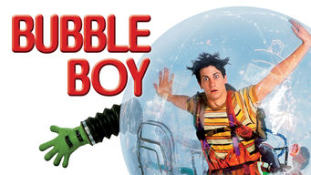

The film Demolition Man [seems to have predicted so much](https://www.youtube.com/watch?v=DrUNIX2Iv04) of the insanity that we are facing today.

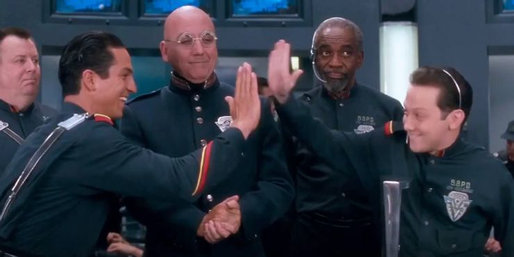

Personally, if there is a virus that actually has a high fatality rate, I would strongly consider a vaccine. However, I don't take the first one, I would give plenty of time to see if there is any news of delayed side effects and I expect it could take years to fully understand if there are delayed side effects. Having said that, when anybody suggest that something is "mandatory", I will be ten times less likely to accept it, purely on principle. Even if it is a syringe of purified water that I sourced myself that you are trying to inject into me, you'd better be prepared to die in your attempt. Sadly though, if the public are forced to do this, it won't be through direct force, but through coercion. As Australia suggested "no jab, no pay".

## 6. Technology

Lets think back to [the speech Sir Tim Berners-Lee give](https://www.ted.com/talks/tim_berners_lee_the_next_web/transcript) about the injustice of our data being siloed by private companies and government instead of using linked data that I discussed earlier. I mentioned that there are new developments to solve these problems. As I mentioned, blockhain allows us to not only own and control our own Bitcoins, but it also allows us to own and control our own data. This also applies to academic and government institutions. This is made possible by [content-addressed storage \(CAS\)](https://searchstorage.techtarget.com/definition/content-addressed-storage).

More information:

[Web 3.0 Explained](https://youtu.be/aPVmd7SyKfQ)

[Web 3.0 Blockchain Introduction](https://youtu.be/hk8ZDqRpURA)

_\[..\]_

_\[intermediation from Steam games to Facebook erasing your posts and connections\]_

### 6.1 Blockchain and cryptocurrencies in a nutshell

_\[that yap video\]_

[https://youtu.be/1IWxCaLdKCI](https://youtu.be/1IWxCaLdKCI)

### 6.2 Self-sovereign digital identity in a nutshell

_\[analogy: secret landscape treasure marker with childhood friend - becomes public proof of id stored in map everyone has a copy of - proof by ownership of knowledge, without surrendering private information \(the technical method is to hash verified claims and store on blockchain with your public key.\)\]_

_\[analogy 2: photo id in club vs photo id for police\]_

#### 6.2.1 ZOOPOS

Anagram for:

Z - Zero external data

O - Open source code

O - Open seed source

P - Public blockchain

O - Open verification provider

S - Separate claims

**Zero external data:** Only a hash \(or “fingerprint”\) of the claims data is stored externally on the blockchain. No user data is stored unless user chooses encrypted cloud backup.

**Open source code:** Open protocol, Open Source.

**Open seed source:** Your can plug in your own private key seed provider. Eg Biometric or Brain wallet.

**Public blockchain:** Just stating the obvious. “Blockchains” that are not public run nodes, open source and permissionless transactions, are not blockchains.

**Open verification**: ANYONE can be a verifier or vouch. Reputation is a separate issue assessed according to use case.

**Separate claims:** Claims are verified, stored and controlled separately. Granular control over credentials.

### 6.3 Community operated ISP

\[...\]

## Appendices

### Appendix A

